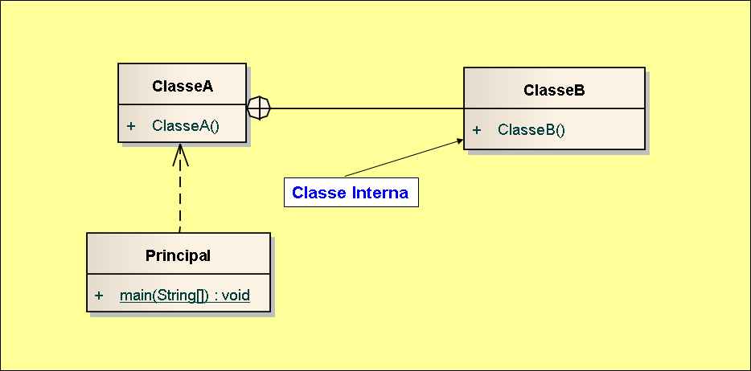

# Exemplo de implementação de relacionamento com classe interna em Java.

## Contextualização

- Programa em Java que demostra a implementação do relacionamento com classe interna. 
- Uma classe interna (também conhecida como classe aninhada) é uma classe definida dentro de outra classe em linguagens de programação orientadas a objetos.  
- A classe interna é geralmente usada quando uma classe precisa ser encapsulada e usada apenas por sua classe externa. 
- A classe interna tem acesso a todos os membros da classe externa, incluindo membros privados, e pode ser usada para implementar algoritmos e estruturas de dados complexas. 
- O projeto foi desenvolvido no NetBeans deve ser chamado relacionamento_uml_classeinterna_java. 
- Utiliza o Apache Maven para a automatização da construção. 

## Diagrama de classes

## Arquivo do projeto

O arquivo Modelo.EAP é o projeto do sistema utilizando ferramanta CASE Enterprise Arquitect.

## Outros arquivos

- pom.xml - Arquivo de configuração da ferramenta de automação Maven.
- *.bat - Arquivos de lote(Batch) de console para tarefas compilar, executar, documentar, empacotar e limpar o projeto.